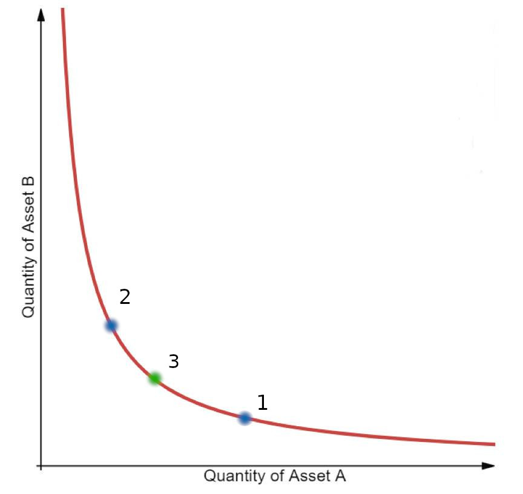

# yAcademy OpenMEV review


**Review Resources:**
[Wiki](/manifoldfinance/OpenMevRouter/wiki)
[Docs and whitepaper](/manifoldfinance/OpenMevRouter/tree/main/docs)

**Residents:**
 - Jackson
 - engn33r

<!-- TOC -->

- [yAcademy OpenMEV review](#yacademy-openmev-review)
    - [Review Summary](#review-summary)
    - [Scope](#scope)
    - [Code Evaluation Matrix](#code-evaluation-matrix)
    - [Findings Explanation](#findings-explanation)
    - [High Findings](#high-findings)
        - [High - The swap and stake mechanisms in OpenMevZapper leave funds in the contract Jackson](#high---the-swap-and-stake-mechanisms-in-openmevzapper-leave-funds-in-the-contract-jackson)
            - [Proof of concept](#proof-of-concept)
            - [Impact](#impact)
            - [Recommendation](#recommendation)
        - [High - Using normal functions for fee-on-transfer tokens causes value loss engn33r](#high---using-normal-functions-for-fee-on-transfer-tokens-causes-value-loss-engn33r)
            - [Proof of concept](#proof-of-concept)
            - [Impact](#impact)
            - [Recommendation](#recommendation)
        - [High - Backrun arb not designed for fee-on-transfer tokens engn33r](#high---backrun-arb-not-designed-for-fee-on-transfer-tokens-engn33r)
            - [Proof of concept](#proof-of-concept)
            - [Impact](#impact)
            - [Recommendation](#recommendation)
    - [Medium Findings](#medium-findings)
        - [Medium - Failed flashloan arbitrage reverts the original swap Jackson](#medium---failed-flashloan-arbitrage-reverts-the-original-swap-jackson)
            - [Proof of concept](#proof-of-concept)
            - [Impact](#impact)
            - [Recommendation](#recommendation)
    - [Low Findings](#low-findings)
        - [Low - Edge case suboptimal arb profit engn33r](#low---edge-case-suboptimal-arb-profit-engn33r)
            - [Proof of concept](#proof-of-concept)
            - [Impact](#impact)
            - [Recommendation](#recommendation)
        - [Low - One failed arb can revert otherwise profitable arb engn33r](#low---one-failed-arb-can-revert-otherwise-profitable-arb-engn33r)
            - [Proof of concept](#proof-of-concept)
            - [Impact](#impact)
            - [Recommendation](#recommendation)
        - [Low - Max approval granted to spender Jackson](#low---max-approval-granted-to-spender-jackson)
            - [Proof of concept](#proof-of-concept)
            - [Impact](#impact)
            - [Recommendation](#recommendation)
        - [Low - No check For Aave flashloan balance Jackson](#low---no-check-for-aave-flashloan-balance-jackson)
            - [Proof of concept](#proof-of-concept)
            - [Impact](#impact)
            - [Recommendation](#recommendation)
    - [Gas Savings Findings](#gas-savings-findings)
        - [Gas - Use _isNonZero for gas savings engn33r](#gas---use-_isnonzero-for-gas-savings-engn33r)
            - [Proof of Concept](#proof-of-concept)
            - [Impact](#impact)
            - [Recommendation](#recommendation)
        - [Gas - Use _inc instead of ++ and _dec instead of -- engn33r](#gas---use-_inc-instead-of--and-_dec-instead-of----engn33r)
            - [Proof of concept](#proof-of-concept)
            - [Impact](#impact)
            - [Recommendation](#recommendation)
        - [Gas - Bitshifting is cheaper than multiplication or division engn33r](#gas---bitshifting-is-cheaper-than-multiplication-or-division-engn33r)
            - [Proof of concept](#proof-of-concept)
            - [Impact](#impact)
            - [Recommendation](#recommendation)
        - [Gas - Unnecessary zero initialization engn33r](#gas---unnecessary-zero-initialization-engn33r)
            - [Proof of Concept](#proof-of-concept)
            - [Impact](#impact)
            - [Recommendation](#recommendation)
        - [Gas - Payable functions can save gas engn33r](#gas---payable-functions-can-save-gas-engn33r)
            - [Proof of concept](#proof-of-concept)
            - [Impact](#impact)
            - [Recommendation](#recommendation)
        - [Gas - Avoid && logic in require statements engn33r](#gas---avoid--logic-in-require-statements-engn33r)
            - [Proof of concept](#proof-of-concept)
            - [Impact](#impact)
            - [Recommendation](#recommendation)
        - [Gas - Declare constant internal when possible engn33r](#gas---declare-constant-internal-when-possible-engn33r)
            - [Proof of concept](#proof-of-concept)
            - [Impact](#impact)
            - [Recommendation](#recommendation)
        - [Gas - Replace require with errors in OpenMevRouter Jackson](#gas---replace-require-with-errors-in-openmevrouter-jackson)
            - [Proof of concept](#proof-of-concept)
            - [Impact](#impact)
            - [Recommendation](#recommendation)
        - [Gas - Remove unused code Jackson](#gas---remove-unused-code-jackson)
            - [Proof of concept](#proof-of-concept)
            - [Impact](#impact)
            - [Recommendation](#recommendation)
        - [Gas - Use simple comparison engn33r](#gas---use-simple-comparison-engn33r)
            - [Proof of concept](#proof-of-concept)
            - [Impact](#impact)
            - [Recommendation](#recommendation)
        - [Gas - Combine reserve value checks engn33r](#gas---combine-reserve-value-checks-engn33r)
            - [Proof of concept](#proof-of-concept)
            - [Impact](#impact)
            - [Recommendation](#recommendation)
        - [Gas - Use msg global vars directly engn33r](#gas---use-msg-global-vars-directly-engn33r)
            - [Proof of concept](#proof-of-concept)
            - [Impact](#impact)
            - [Recommendation](#recommendation)
        - [Gas - Remove duplicate internal function call engn33r](#gas---remove-duplicate-internal-function-call-engn33r)
            - [Proof of concept](#proof-of-concept)
            - [Impact](#impact)
            - [Recommendation](#recommendation)
        - [Gas - deadline special case not aligned with permit engn33r](#gas---deadline-special-case-not-aligned-with-permit-engn33r)
            - [Proof of concept](#proof-of-concept)
            - [Impact](#impact)
            - [Recommendation](#recommendation)
        - [Gas - Replace pair.swap with _asmSwap engn33r](#gas---replace-pairswap-with-_asmswap-engn33r)
            - [Proof of concept](#proof-of-concept)
            - [Impact](#impact)
            - [Recommendation](#recommendation)
        - [Gas - Remove a sortTokens call engn33r](#gas---remove-a-sorttokens-call-engn33r)
            - [Proof of concept](#proof-of-concept)
            - [Impact](#impact)
            - [Recommendation](#recommendation)
        - [Gas - Missing curly brace engn33r](#gas---missing-curly-brace-engn33r)
            - [Proof of concept](#proof-of-concept)
            - [Impact](#impact)
            - [Recommendation](#recommendation)
        - [Gas - More efficient variable swap engn33r](#gas---more-efficient-variable-swap-engn33r)
            - [Proof of concept](#proof-of-concept)
            - [Impact](#impact)
            - [Recommendation](#recommendation)
        - [Gas - Reduce number of swaps engn33r](#gas---reduce-number-of-swaps-engn33r)
            - [Proof of concept](#proof-of-concept)
            - [Impact](#impact)
            - [Recommendation](#recommendation)
        - [Gas - Revert if zero flashloan profit engn33r](#gas---revert-if-zero-flashloan-profit-engn33r)
            - [Proof of concept](#proof-of-concept)
            - [Impact](#impact)
            - [Recommendation](#recommendation)
    - [Informational Findings](#informational-findings)
        - [Informational - OpenMevRouter should inherit from IFlashBorrower and IOpenMevRouter Jackson](#informational---openmevrouter-should-inherit-from-iflashborrower-and-iopenmevrouter-jackson)
            - [Impact](#impact)
        - [Informational - The ETHERSCAN_API key is present in plaintext Jackson](#informational---the-etherscan_api-key-is-present-in-plaintext-jackson)
            - [Impact](#impact)
        - [Informational - SafeTransferLib does not match Solmate's main branch Jackson](#informational---safetransferlib-does-not-match-solmates-main-branch-jackson)
            - [Impact](#impact)
        - [Informational - Incorrect comment engn33r, Jackson](#informational---incorrect-comment-engn33r-jackson)
            - [Proof of concept](#proof-of-concept)
            - [Impact](#impact)
            - [Recommendation](#recommendation)
        - [Informational - Replace magic numbers with constants engn33r](#informational---replace-magic-numbers-with-constants-engn33r)
            - [Proof of concept](#proof-of-concept)
            - [Impact](#impact)
            - [Recommendation](#recommendation)
        - [Informational - Typos engn33r](#informational---typos-engn33r)
            - [Proof of concept](#proof-of-concept)
            - [Impact](#impact)
            - [Recommendation](#recommendation)
        - [Informational - Hard coded Aave token list engn33r](#informational---hard-coded-aave-token-list-engn33r)
            - [Proof of concept](#proof-of-concept)
            - [Impact](#impact)
            - [Recommendation](#recommendation)
        - [Informational - Inconsistency in WETH transfers engn33r](#informational---inconsistency-in-weth-transfers-engn33r)
            - [Proof of concept](#proof-of-concept)
            - [Impact](#impact)
            - [Recommendation](#recommendation)
        - [Informational - safeApprove vulnerable to double withdraw engn33r](#informational---safeapprove-vulnerable-to-double-withdraw-engn33r)
            - [Proof of concept](#proof-of-concept)
            - [Impact](#impact)
            - [Recommendation](#recommendation)
        - [Informational - Same frontrunning weaknesses as Uniswap/SushiSwap engn33r](#informational---same-frontrunning-weaknesses-as-uniswapsushiswap-engn33r)
            - [Proof of concept](#proof-of-concept)
            - [Impact](#impact)
            - [Recommendation](#recommendation)
        - [Informational - Kashi flashloanable tokens assumed same as aave engn33r](#informational---kashi-flashloanable-tokens-assumed-same-as-aave-engn33r)
            - [Proof of concept](#proof-of-concept)
            - [Impact](#impact)
            - [Recommendation](#recommendation)
        - [Informational -  engn33r](#informational----engn33r)
            - [Proof of concept](#proof-of-concept)
            - [Impact](#impact)
            - [Recommendation](#recommendation)
    - [Final remarks](#final-remarks)
        - [engn33r](#engn33r)
        - [Jackson](#jackson)
    - [About yAcademy](#about-yacademy)
    - [Appendix and FAQ](#appendix-and-faq)

<!-- /TOC -->


## Review Summary

**OpenMEV**

The purpose of OpenMEVRouter is to offer a drop-in replacement to a similar Uniswap/SushiSwap router. While enabling exchanges with UniSwap and SushiSwap, it also protects against direct MEV arbitrage (arb) between the two platforms by performing the arb within the DEX swap process. This leaves no arbitrage opportunities for MEV searches.

The main branch of the OpenMEV [Repo](/manifoldfinance/OpenMevRouter) was reviewed over 22 days, 4 of which were used to create an initial overview of the contract. The code review was performed between May 12 and June 3, 2022. The code was reviewed by 2 residents for a total of 59 man hours (engn33r: 34 hours, and Jackson 25 hours). The repository was under active development during the review, but the review was limited to [one specific commit](/manifoldfinance/OpenMevRouter/commit/8648277c0a89d0091f959948682543bdcf0c280b).

## Scope
[Code Repo](/manifoldfinance/OpenMevRouter)
[Commit](/manifoldfinance/OpenMevRouter/commit/8648277c0a89d0091f959948682543bdcf0c280b)

The commit reviewed was 8648277c0a89d0091f959948682543bdcf0c280b. The review covered the entire repository at this specific commit but focused on the contracts directory.

After the findings were presented to the OpenMEV team, fixes were made and included in several PRs.

The review was a time-limited review to provide rapid feedback on potential vulnerabilities. The review was not a full audit. The review did not explore all potential attack vectors or areas of vulnerability and may not have identified all potential issues.

yAcademy and the residents make no warranties regarding the security of the code and do not warrant that the code is free from defects. yAcademy and the residents do not represent nor imply to third parties that the code has been audited nor that the code is free from defects. Manifold and third parties should use the code at their own risk.

Code Evaluation Matrix
---

| Category                 | Mark    | Description                                                                                                                                                                                                                                                                                                                                                                                                                                                                                                                                                                                     |
| ------------------------ | ------- | ----------------------------------------------------------------------------------------------------------------------------------------------------------------------------------------------------------------------------------------------------------------------------------------------------------------------------------------------------------------------------------------------------------------------------------------------------------------------------------------------------------------------------------------------------------------------------------------------- |
| Access Control           | Good    | The onlyOwner modifier was only applied to the `harvest()` function. Access controls existed on the relevant callback functions in OpenMevRouter.sol for flashloans. msg.sender is properly used so that the user cannot perform actions they should not be able to. Access controls are applied where needed.                                                                                                                                                                                                                                                                                  |
| Mathematics              | Average | Solidity 0.8.13 is used, which provides overflow and underflow protect. There was no unusually complex math beyond the Uint512 library. The `sqrt512()` function using the Karatsuba Square Root method is an unusual and potentially custom implementation.                                                                                                                                                                                                                                                                                                                                    |
| Complexity               | Average | Many function names and implementations are borrowed from UniswapV2 contracts and BeefySwap's zapper. This reduces the amount of custom development work necessary. The primary source of complexity is the backrun swap arb process and the equations derived for that purpose.                                                                                                                                                                                                                                                                                                                |
| Libraries                | Good    | A custom OpenMevLibrary contract is based heavily on the UniswapV2Library contract. The Uint512 contract supports math operations for uint512 integers comprised of two uint256 integers. SafeTransferLib and ERC20 libraries are imported by OpenMevRouter but are commonly used contracts.                                                                                                                                                                                                                                                                                                    |
| Decentralization         | Good    | The onlyOwner modifier on the `harvest()` function indicates there is some centralization risk, but it is expected that Sushi governance will take this role and can be considered a trusted party.                                                                                                                                                                                                                                                                                                                                                                                             |
| Code stability           | Good    | Changes were reviewed at a specific commit hash and the scope was not expanded after the review was started. The code reviewed had nearly all features implemented.                                                                                                                                                                                                                                                                                                                                                                                                                             |
| Documentation            | Good    | Comments existed in many places, but were lacking in key areas. As one example, identically named _updateReward functions existed in Gauge.sol, ExtraReward.sol and VeYfiRewards.sol, but no comments existed on either function and no explanation of the differences of these identically-named function existed. It would be best if more thorough comments and documentation was added throughout the code to better explain the purpose of different functions and specific math that is performed. No developer documentation like gitbooks was observed for veYFI at the time of review. |
| Monitoring               | Average | Only `_backrunSwaps()` emitted an event. However, the UniswapV2 Router does not emit any events and the OpenMevRouter contracts prioritize gas savings, so additional events may not be necessary.                                                                                                                                                                                                                                                                                                                                                                                              |
| Testing and verification | Average | Brownie tests and foundry tests were written. The foundry tests were more comprehensive that the brownie tests, but getting the exact test coverage numbers with foundry is still [a work in progress](/foundry-rs/foundry/issues/99) at the time this review was performed. The coverage could be improved to test for the edge cases introduced by modifications to the forked Uniswap and BeefySwap contracts as demonstrated by the findings.                                                                                                                             |

## Findings Explanation

Findings are broken down into sections by their respective impact:
 - Critical, High, Medium, Low impact
     - These are findings that range from attacks that may cause loss of funds, impact control/ownership of the contracts, or cause any unintended consequences/actions that are outside the scope of the requirements,
 - Gas savings
     - Findings that can improve the gas efficiency of the contracts
 - Informational
     - Findings including recommendations and best practices
---

## High Findings

### 1. High - The swap and stake mechanisms in OpenMevZapper leave funds in the contract (Jackson)

Half of the input amount in both `swapAndStakeLiquidity` and `swapETHAndStakeLiquidity` is used as the `swapAmountIn` when atomically swapping and staking.  However, this leaves funds in the contract due to the reserve asset ratio change post-swap.  See ["Optimal One-sided Supply to Uniswap"](https://blog.alphaventuredao.io/onesideduniswap/) for more information.

#### Proof of concept

Both [`swapAdStakeLiquidity`] [link](manifoldfinance/OpenMevRouter/blob/8648277c0a89d0091f959948682543bdcf0c280b/contracts/OpenMevZapper.sol#L126-L159) and [`swapETHAndStakeLiquidity`] [link](manifoldfinance/OpenMevRouter/blob/8648277c0a89d0091f959948682543bdcf0c280b/contracts/OpenMevZapper.sol)-L195) take the input tokens or ETH sent by a user, divide it by 2, swap it into the B token, and stake these tokens as a pair.  However, this approach leaves some of the B token in the contract due to the reserve asset ratio change before and after the swap.

#### Impact

High.  The funds are not returned to the user, and will likely be swept by Sushi governance during a call to `harvest`.

#### Recommendation

Use the formula found in ["Optimal One-sided Supply to Uniswap"](https://blog.alphaventuredao.io/onesideduniswap/) for the `swapAmountIn`, rather than ` / 2`.


```solidity
sqrt(
    reserveIn.mul(userIn.mul(3988000) + reserveIn.mul(3988009)))
        .sub(reserveIn.mul(1997)) / 1994;
```

### 2. High - Using normal functions for fee-on-transfer tokens causes value loss (engn33r)

Uniswap's code relies on the assumption that functions without direct support for fee-on-transfer tokens, like `removeLiquidityETH`, will revert. This assumption is invalid in OpenMevRouter. The difference is that Uniswap routers are designed to [not hold token balance](https://docs.uniswap.org/protocol/V2/reference/smart-contracts/router-02), which [the etherscan token balance confirms](https://etherscan.io/address/0x7a250d5630B4cF539739dF2C5dAcb4c659F2488D). In comparison, the docs for OpenMevRouter.sol show it stores value that is later collected with the `harvest()` function. If enough fee-on-transfer tokens are held by the OpenMevRouter contract, functions such as `removeLiquidityETH()` can be called instead of `removeLiquidityETHSupportingFeeOnTransferTokens()` and the function will not revert. This leads to the OpenMevRouter contract losing value due to the fees paid for the fee-on-transfer transfer.

#### Proof of concept

The NatSpec comment for `removeLiquidityETHSupportingFeeOnTransferTokens()` includes
```
Identical to removeLiquidityETH, but succeeds for tokens that take a fee on transfer
```

The only difference in these functions, and what is implied to cause the revert condition in `removeLiquidityETH()`, is the amount used in `safeTransfer()`. `removeLiquidityETH()` has an amount of `amountToken`, while `removeLiquidityETHSupportingFeeOnTransferTokens()` uses `ERC20(token).balanceOf(address(this)) - balanceBefore`. This does cause a revert in Uniswap's code because of the Uniswap assumption that the router holds no token balance, but OpenMevRouter can hold a token balance.

The process of value loss is:
1. Fee-on-transfer token is held by the router. This can happen either with an initial deposit by the Manifold team or from backrun arbitrage profits. The devs suggested the tokens that will be sent to the router will likely be tokens that Aave does not support flashloans for, which could include lesser known tokens with fee-on-transfer support.
2. User wants to remove liquidity from WETH-ERC20 pair where the ERC20 has a non-zero fee-on-transfer. Instead of using  `removeLiquidityETHSupportingFeeOnTransferTokens()`, the user calls `removeLiquidityETH()`.
3. The code of `removeLiquidityETHSupportingFeeOnTransferTokens()` and `removeLiquidityETH()` is identical except for the amount in `ERC20(token).safeTransfer()`. The `amountToken` value used in `removeLiquidityETH()` is greater than the amount of fee-on-transfer tokens received from the `removeLiquidity()` call, so the amount transferred to the user will include some of the token balance that was held by the router before the user's remove liquidity interaction.
4. Result: The router lost value in the form of the transfer-on-fee token

#### Impact

High. Value can be lost from the router if the router stores fee-on-transfer tokens. While it may be unlikely for OpenMevRouter.sol to hold many fee-on-transfer tokens (note: USDT could become fee-on-transfer in the future), value loss would occur if the scenario does arise and no protections prevent against this.

#### Recommendation

The router should follow the Uniswap assumptions and not store value. Instead, the profits from any arbs should be stored in a separate contract where it can be flashloaned to the router for arbitrage opportunities. This would impact the `harvest()` and `_backrunSwaps()` functions at a minimum, and most likely require some redesigning of the overall contract.

If there is a preference to maintain the current design where the router holds value, add stricter checks to functions not designed for fee-on-transfer tokens. For example, a rewrite of `removeLiquidityETH()` logic:

```solidity
ensure(deadline);
address weth = WETH09;
uint256 balanceBefore = ERC20(token).balanceOf(address(this));
(amountToken, amountETH) = removeLiquidity(
    token,
    weth,
    liquidity,
    amountTokenMin,
    amountETHMin,
    address(this),
    deadline
);
if (amountToken != ERC20(token).balanceOf(address(this)) - balanceBefore) revert TokenIsFeeOnTransfer();
ERC20(token).safeTransfer(to, amountToken);
IWETH(weth).withdraw(amountETH);
SafeTransferLib.safeTransferETH(to, amountETH);
```

### 3. High - Backrun arb not designed for fee-on-transfer tokens (engn33r)

The backrun process is performed for any swap, but the backrun process is not designed for fee-on-transfer tokens. Because the router contract may hold fee-on-transfer tokens, the router contract may lose some of this stored value to fees when performing an arb involving a fee-on-transfer token.

#### Proof of concept 

While Aave and Kashi do not currently allow flashloans on any fee-on-transfer tokens, this call of `_arb()` using internal router contract funds is problematic:
[ref](manifoldfinance/OpenMevRouter/blob/8648277c0a89d0091f959948682543bdcf0c280b/contracts/OpenMevRouter.sol)

The two swaps are performed with `_asmSwap()`, which have a `safeTransfer()` performed first to send the token to the pair address.
- [ref](manifoldfinance/OpenMevRouter/blob/8648277c0a89d0091f959948682543bdcf0c280b/contracts/OpenMevRouter.sol)
- [ref](manifoldfinance/OpenMevRouter/blob/8648277c0a89d0091f959948682543bdcf0c280b/contracts/OpenMevRouter.sol)

It is assumed that the `amountOut` value calculated by `OpenMevLibrary.getAmountOut()` accurately stores the amount of tokens that the router contract receives from the swap process. Instead, to support fee-on-transfer tokens, a calculation of `ERC20(token).balanceOf(address(this)) - balanceBefore` as found in the router function `removeLiquidityETHSupportingFeeOnTransferTokens()` should be used.

The `_arb()` fuction can even cause problems when neither the first nor last token is a fee-on-transfer token, but one of the intermediate swaps uses a fee-on-transfer token. Because the `_backrunSwaps()` function [loops through the array of swaps]([link](manifoldfinance/OpenMevRouter/blob/8648277c0a89d0091f959948682543bdcf0c280b/contracts/OpenMevRouter.sol)), any of the backrun swaps that involve a fee-on-transfer token could be problematic.

#### Impact

High. The router contract can lose funds when paying fees for fee-on-transfer token transfers.

#### Recommendation

If the router is redesigned to not hold fee-on-transfer tokens, the backrun would likely revert because the math is not designed for fee-on-transfer tokens. The easiest solution is to remove the `_backrunSwaps()` calls when a fee-on-transfer swap is involved. Another option is to write a new `_arb()` function that supports fee-on-transfer arbitrage.
- [ref](manifoldfinance/OpenMevRouter/blob/8648277c0a89d0091f959948682543bdcf0c280b/contracts/OpenMevRouter.sol)
- [ref](manifoldfinance/OpenMevRouter/blob/8648277c0a89d0091f959948682543bdcf0c280b/contracts/OpenMevRouter.sol)
- [ref](manifoldfinance/OpenMevRouter/blob/8648277c0a89d0091f959948682543bdcf0c280b/contracts/OpenMevRouter.sol)


## Medium Findings

### 1. Medium - Failed flashloan arbitrage reverts the original swap (Jackson)

If one of the backrun flashloan arbitrages fails to return a profit, the original swap is reverted.

#### Proof of concept 

These nes include the revert for each flashloan [[1]([link](manifoldfinance/OpenMevRouter/blob/8648277c0a89d0091f959948682543bdcf0c280b/contracts/OpenMevRouter.sol)), [2]([link](manifoldfinance/OpenMevRouter/blob/8648277c0a89d0091f959948682543bdcf0c280b/contracts/OpenMevRouter.sol))].

#### Impact
 
Medium. While this will not involve a loss of user funds, it will result it a poor user experience when user swaps are unecessarily reverted.

#### Recommendation

Use a try-catch when executing the flashloans such that if they revert, the entire swap is not also reverted.

## Low Findings

### 1. Low - Edge case suboptimal arb profit (engn33r)

There can be cases where `contractAssetBalance >= optimalAmount` is not true, but using the available contractAssetBalance is still cheaper than using a flashloan with a fee. For example, if `contractAssetBalance = optimalAmount - 1`, using `contractAssetBalance` will normally produce a superior result to using a flashloan.

#### Proof of concept

The logic branch checks if `contractAssetBalance >= optimalAmount`, otherwise a flashloan is used
[ref](manifoldfinance/OpenMevRouter/blob/8648277c0a89d0091f959948682543bdcf0c280b/contracts/OpenMevRouter.sol)

#### Impact

Low. This is an edge case that may be rare, but can reduce the profits of the router. Hypothetically this could be gamed by liquidity providers looking to increase yield through flashloan fees on certain assets in Aave or Kashi, because the fees are paid by OpenMevRouter arb profits.

#### Recommendation

When calculating the optimalAmount for the backrun process, account for the profit loss due to Aave or Kashi fees.

### 2. Low - One failed arb can revert otherwise profitable arb (engn33r)

The `_backrunSwaps()` function may loop through multiple swaps to arbitrage each one. If one of these swaps does not have a sufficiently profitable opportunity or has a failed flashloan, the profitable opportunity from the other swaps may be missed.

#### Proof of concept

The `_bacruSwaps()` function [loops through the array of swaps]([link](manifoldfinance/OpenMevRouter/blob/8648277c0a89d0091f959948682543bdcf0c280b/contracts/OpenMevRouter.sol#L877). Imagine a scenario where `_backrunSwaps()` is called with a swaps array of length 4. Assume the 1st, 2nd, and 4th backrun swaps are profitable, but the 3rd backrun swap is not. Performing this series of four backrun swaps can still be net profitable even if one of the individual backrun swaps is not. The reason the 3rd backrun swap is not profitable may be because the flashloan fee costs more than the profit of this arb, which reverts [here]([link](manifoldfinance/OpenMevRouter/blob/8648277c0a89d0091f959948682543bdcf0c280b/contracts/OpenMevRouter.sol#L966) or [here]([link](manifoldfinance/OpenMevRouter/blob/8648277c0a89d0091f959948682543bdcf0c280b/contracts/OpenMevRouter.sol)), or [a similar revert can happen]([link](manifoldfinance/OpenMevRouter/blob/8648277c0a89d0091f959948682543bdcf0c280b/contracts/OpenMevRouter.sol)) if the router contract funds are used for the arb and the amount received is less than expected.

The result is the transaction reverts and OpenMevRouter will miss out on the arb profits if the swaps had been completed even if one individual backrun swap wasn't profitable.

#### Impact

Low. This is an edge case that may be rare, but can reduce the profits of the router.

#### Recommendation

A single flashloan or arb opportunity resulting in no profit should not revert the entire transaction. Instead, that specific backrun swap arb should be skipped. It is not even necessary to skip an unprofitable backrun swap if there is a positive net profit that is calculated at the start of the `_backrunSwaps()` function.

### 3. Low - Max approval granted to spender (Jackson)

Maximum approvals should be avoided, particularly when the necessary amount is known.

#### Proof of concept

`ERC20(token).safeApprove(spender, type(uint256).max);` in `_approveTokenIfNeeded` approves the spend to spent the entire balance.

#### Impact

Low. Assuming nothing problematic occurs this is not a problem.  However, it is a level of protection in case of attack.

#### Recommendation

Only approve what is necessary for the transaction when it is known prior to granting approval.

### 4. Low - No check For Aave flashloan balance (Jackson)

`_backrunSwaps` in `OpenMevRouter` checks that Kashi has the necessary liqudity to take a flashloan against, but does not check that Aave does as well.

#### Proof of concept

L915 of OpenMevRouter

[ref](manifoldfinance/OpenMevRouter/blob/8648277c0a89d0091f959948682543bdcf0c280b/contracts/OpenMevRouter.sol)

#### Impact

Low. It is unlikely that Aave will not have the necessary liquidity for the flashloan.

#### Recommendation

Check that Aave contains the necessary liquidity at the time of the flashloan as is done for Kashi. A fix is underway in [PR #40](/manifoldfinance/OpenMevRouter/pull/40).


## Gas Savings Findings

### 1. Gas - Use `_isNonZero()` for gas savings (engn33r)

There is a gas efficient `_isNonZero()` function that is not used in two places. Otherwise, `!= 0` is preferred to `> 0` when comparing a uint to zero.

#### Proof of Concept

Two instances of this were found:
- [link](manifoldfinance/OpenMevRouter/blob/8648277c0a89d0091f959948682543bdcf0c280b/contracts/OpenMevZapper.sol#L68)
- [ref](manifoldfinance/OpenMevRouter/blob/8648277c0a89d0091f959948682543bdcf0c280b/contracts/OpenMevRouter.sol)

#### Impact

Gas savings

#### Recommendation

Replace `> 0` with `!= 0` to save gas. Even better, use the existing `_isNonZero()` function in OpenMevLibrary.sol.

### 2. Gas - Use `_inc()` instead of `++` and `_dec()` instead of `--` (engn33r)

Gas efficient functions `_inc()` and `_dec()` should be used to replace normal increments and decrements. Otherwise, if these functions were not available, use prefix is preferred to postfix for gas efficiency. In other words, use `++i` instead of `i++`.

#### Proof of concept

There is one instance of an increment improvement:
- [link](manifoldfinance/OpenMevRouter/blob/8648277c0a89d0091f959948682543bdcf0c280b/contracts/OpenMevZapper.sol#L66)

There are two instances of a double decrement that could be replaced with `_dec(_decr())` or with `unchecked { length - 2; }`:
- [ref](manifoldfinance/OpenMevRouter/blob/8648277c0a89d0091f959948682543bdcf0c280b/contracts/libraries/OpenMevLibrary.sol)
- [ref](manifoldfinance/OpenMevRouter/blob/8648277c0a89d0091f959948682543bdcf0c280b/contracts/libraries/OpenMevLibrary.sol)

#### Impact

Gas savings

#### Recommendation

Increment with prefix addition and not postfix in for loops. Even better, use `_inc()` and `_dec()`.

### 3. Gas - Bitshifting is cheaper than multiplication or division (engn33r)

Bitshifting is cheaper than multiplication or division. Multiplication and division can be replaced by a bitshift easily when a multiple of two is involved.

#### Proof of concept

There are two instance of divide by 2 operations that can use bitshifting for gas efficiency:
- [ref](manifoldfinance/OpenMevRouter/blob/8648277c0a89d0091f959948682543bdcf0c280b/contracts/OpenMevZapper.sol)
- [ref](manifoldfinance/OpenMevRouter/blob/8648277c0a89d0091f959948682543bdcf0c280b/contracts/OpenMevZapper.sol)
- [ref](manifoldfinance/OpenMevRouter/blob/8648277c0a89d0091f959948682543bdcf0c280b/contracts/OpenMevZapper.sol)
- [ref](manifoldfinance/OpenMevRouter/blob/8648277c0a89d0091f959948682543bdcf0c280b/contracts/libraries/Uint512.sol)

#### Impact

Gas savings

#### Recommendation

Replace multiplication and vision by a bitshift when a power of two is involved.

### 4. Gas - Unnecessary zero initialization (engn33r)

Initializing an int or uint to zero is unnecessary, because solidity defaults int/uint variables to a zero value. Removing the initialization to zero can save gas.

#### Proof of Concept

Several instances of this were found:
- [link](manifoldfinance/OpenMevRouter/blob/8648277c0a89d0091f959948682543bdcf0c280b/contracts/libstd/OpenMevErrors.sol#L71
- [ref](manifoldfinance/OpenMevRouter/blob/8648277c0a89d0091f959948682543bdcf0c280b/contracts/OpenMevRouter.sol)

#### Impact

Gas savings

#### Recommendation

Remove the explicit uint variable initializations to zero.

### 5. Gas - Payable functions can save gas (engn33r)

If there is no risk of a function accidentally receiving ether, such as a function with the onlyOwner modifier, this function can use the payable modifier to save gas.

#### Proof of concept

The following functions have the onlyOwner modifier and can be marked as payable
- [ref](manifoldfinance/OpenMevRouter/blob/8648277c0a89d0091f959948682543bdcf0c280b/contracts/OpenMevRouter.sol)
- [link](manifoldfinance/OpenMevRouter/blob/8648277c0a89d0091f959948682543bdcf0c280b/contracts/TwoStepOwnable.sol#L66)
- [link](manifoldfinance/OpenMevRouter/blob/8648277c0a89d0091f959948682543bdcf0c280b/contracts/TwoStepOwnable.sol#L80)

#### Impact

Gas savings

#### Recommendation

Mark functions that have onlyOwner as payable for gas savings. This might not be aesthetically pleasing, but it works.

### 6. Gas - Avoid && logic in require statements (engn33r)

Using && logic in require statements uses more gas than using separate require statements. Dividing the logic into multiple require statements is more gas efficient.

#### Proof of concept

One instance of require with && logic was found:
- [ref](manifoldfinance/OpenMevRouter/blob/8648277c0a89d0091f959948682543bdcf0c280b/contracts/ERC20.sol)

#### Impact

Gas savings

#### Recommendation

Replace require statements that use && by dividing up the logic into multiple require statements.

### 7. Gas - Declare constant internal when possible (engn33r)

Declaring constant with internal visibility is cheaper than public constants. This is already applied to all constants in the code except one.

#### Proof of concept

The `bento` constant should be internal if possible:
- [link](manifoldfinance/OpenMevRouter/blob/8648277c0a89d0091f959948682543bdcf0c280b/contracts/OpenMevRouter.sol#L89)

#### Impact

Gas savings

#### Recommendation

Make constant variables internal for gas savings.

### 8. Gas - Replace require with errors in OpenMevRouter (Jackson)

Two require statements can be replaced with custom errors in OpenMevRouter.

Custom errors are already used elsewhere in OpenMevRouter and are more gas-efficient than require statements: https://blog.soliditylang.org/2021/04/21/custom-errors/

#### Proof of concept

One in `_addLiquidity` (`require(amountAOptimal <= amountADesired);`) and another in `addLiquidityETH` (`require(IWETH(weth).transfer(pair, amountETH));`, which can be replaced with `safeTransfer` as is done in `swapExactETHForTokens`).
- [ref](manifoldfinance/OpenMevRouter/blob/8648277c0a89d0091f959948682543bdcf0c280b/contracts/OpenMevRouter.sol)
- [ref](manifoldfinance/OpenMevRouter/blob/8648277c0a89d0091f959948682543bdcf0c280b/contracts/OpenMevRouter.sol)

#### Impact

Gas savings

#### Recommendation

Use solidity custom errors instead of require statements.

### 9. Gas - Remove unused code (Jackson)

`RESERVE_SELECTOR` is not used in `OpenMevLibrary` and can be removed, neither are `_require()` or `_revert()` in `OpenMevErrors`.

#### Proof of concept

1. [link](manifoldfinance/OpenMevRouter/blob/8648277c0a89d0091f959948682543bdcf0c280b/contracts/libraries/OpenMevLibrary.sol#L36)
2. [link](manifoldfinance/OpenMevRouter/blob/8648277c0a89d0091f959948682543bdcf0c280b/contracts/libstd/OpenMevErrors.sol#L9)
3. [link](manifoldfinance/OpenMevRouter/blob/8648277c0a89d0091f959948682543bdcf0c280b/contracts/libstd/OpenMevErrors.sol#L16)

#### Impact

Gas savings

#### Recommendation

Remove unused code to save gas on deployment.

### 10. Gas - Use simple comparison (engn33r)

Using a compound comparison such as ≥ or ≤ uses more gas than a simple comparison check like >, <, or ==. Compound comparison operators can be replaced with simple ones for gas savings.

#### Proof of concept

The `_addLiquidity()` function in OpenMenRouter.sol contains
[ref](manifoldfinance/OpenMevRouter/blob/8648277c0a89d0091f959948682543bdcf0c280b/contracts/OpenMevRouter.sol-L143)

```solidity
if (amountBOptimal <= amountBDesired) {
    // require(amountBOptimal >= amountBMin, 'UniswapV2Router: INSUFFICIENT_B_AMOUNT');
    if (amountBOptimal < amountBMin) revert InsufficientBAmount();
    // revert InsufficientBAmount({ available: amountBOptimal, required: amountBMin });
    (amountA, amountB) = (amountADesired, amountBOptimal);
} else {
    uint256 amountAOptimal = OpenMevLibrary.quote(amountBDesired, reserveB, reserveA);
    require(amountAOptimal <= amountADesired);
    // require(amountAOptimal >= amountAMin, 'UniswapV2Router: INSUFFICIENT_A_AMOUNT');
    if (amountAOptimal < amountAMin) revert InsufficientAAmount();
    // revert InsufficientAAmount({ available: amountAOptimal, required: amountAMin });
    (amountA, amountB) = (amountAOptimal, amountBDesired);
}
```

By switching around the if/else clauses, we can replace the compound operator with a simple one

```solidity
if (amountBOptimal > amountBDesired) {
    uint256 amountAOptimal = OpenMevLibrary.quote(amountBDesired, reserveB, reserveA);
    require(amountAOptimal <= amountADesired);
    // require(amountAOptimal >= amountAMin, 'UniswapV2Router: INSUFFICIENT_A_AMOUNT');
    if (amountAOptimal < amountAMin) revert InsufficientAAmount();
    // revert InsufficientAAmount({ available: amountAOptimal, required: amountAMin });
    (amountA, amountB) = (amountAOptimal, amountBDesired);
} else {
    // require(amountBOptimal >= amountBMin, 'UniswapV2Router: INSUFFICIENT_B_AMOUNT');
    if (amountBOptimal < amountBMin) revert InsufficientBAmount();
    // revert InsufficientBAmount({ available: amountBOptimal, required: amountBMin });
    (amountA, amountB) = (amountADesired, amountBOptimal);
}
```

Another instance of this improvement is found with the comparison `>= 1`. Two other instances of this are in OpenMevLibrary.sol (lines 270 and 331), but to show the example from `_swapSupportingFeeOnTransferTokens()`
[ref](manifoldfinance/OpenMevRouter/blob/8648277c0a89d0091f959948682543bdcf0c280b/contracts/OpenMevRouter.sol)

```solidity
swaps[i].isBackrunable = ((1000 * amountInput) / reserveInput) >= 1;
```

Because `>= 1` equates to `> 0`, and G1 shows how `!= 0` or `_isNonZero()` is better than `> 0`, the comparison can be simplified to

```solidity
swaps[i].isBackrunable = _isNonZero(((1000 * amountInput) / reserveInput));
```

#### Impact

Gas savings

#### Recommendation

Replace compound comparison operators with simple ones for gas savings.

### 11. Gas - Combine reserve value checks (engn33r)

`getAmountOut()` in OpenMevLibrary.sol checks if the reserve values with `_isZero()`. Most locations where `OpenMevLibrary.getAmountOut()` is called also use the check `if (reserve0 < 1000 || reserve1 < 1000)` before `getAmountOut()` is called. Rather than duplicating similar checks, gas could be saved by consistently checking reserve values before calling `getAmountOut()`, or requiring `reserve0 < 1000 && reserve1 < 1000` inside `getAmountOut()`.

#### Proof of concept

Most places where `OpenMevLibrary.getAmountOut()` in OpenMevZapper results in duplicated reserve checks.
[link](manifoldfinance/OpenMevRouter/blob/8648277c0a89d0091f959948682543bdcf0c280b/contracts/OpenMevZapper.sol

#### Impact

Gas savings

#### Recommendation

Remove duplicated reserves checks to save gas

### 12. Gas - Use msg global vars directly (engn33r)

Using msg.sender and msg.value without caching is slightly more gas efficient than caching the value.

#### Proof of concept

msg.value is unnecessarily cached in:
- `addiquidityETH()` [link](manifoldfinance/OpenMevRouter/blob/8648277c0a89d0091f959948682543bdcf0c280b/contracts/OpenMevRouter.sol)
- `swapETHForExactToens()` [link](manifoldfinance/OpenMevRouter/blob/8648277c0a89d0091f959948682543bdcf0c280b/contracts/OpenMevRouter.sol)
- `swapETHAdStakeLiquidity()` [link](manifoldfinance/OpenMevRouter/blob/8648277c0a89d0091f959948682543bdcf0c280b/contracts/OpenMevZapper.sol)

msg.value can replace swaps[0].amountIn
- `swapExactETHForToens()` [link](manifoldfinance/OpenMevRouter/blob/8648277c0a89d0091f959948682543bdcf0c280b/contracts/OpenMevRouter.sol#L564 and [link](manifoldfinance/OpenMevRouter/blob/8648277c0a89d0091f959948682543bdcf0c280b/contracts/OpenMevRouter.sol)

#### Impact

Gas savings

#### Recommendation

Improve gas efficiency by removing the caching of msg global vars to use the global vars directly

### 13. Gas - Remove duplicate internal function call (engn33r)

`ensure()` gets called twice in ETH-related functions. The first call happens at the start of `addLiquidityETH()` or `removeLiquidityETH()`, and the second call happens when this function calls `addLiquidity()` or `removeLiquidity()`. However, this only helps in the case where no revert occurs, otherwise reverting earlier is better.

#### Proof of concept

One example
Frst call: [link](manifoldfinance/OpenMevRouter/blob/8648277c0a89d0091f959948682543bdcf0c280b/contracts/OpenMevRouter.sol)
Secod call: [link](manifoldfinance/OpenMevRouter/blob/8648277c0a89d0091f959948682543bdcf0c280b/contracts/OpenMevRouter.sol)

#### Impact

Gas savings

#### Recommendation

Remove the `ensure()` call at the start of the ETH-related functions in OpenMevRouter.sol.

### 14. Gas - deadline special case not aligned with permit (engn33r)

From EIP-2612:
```
The deadline argument can be set to uint(-1) to create Permits that effectively never expire.
```

In contrast, `ensure()` implies a value of zero for a deadline that never expires

```solidity
if (deadline < block.timestamp && _isNonZero(deadline)) revert Expired();
```

#### Proof of concept

EIP-2612 text
https://eips.ethereum.org/EIPS/eip-2612#rationale

`ensure()` function
[link](manifoldfinance/OpenMevRouter/blob/8648277c0a89d0091f959948682543bdcf0c280b/contracts/OpenMevRouter.sol#L98

#### Impact

Gas savings

#### Recommendation

Use the same permit approach as EIP-2612. This simplifies and aligns the check in `ensure()` to match Uniswap's check.

Uniswap code:
/Uniswap/v2-core/blob/8b82b04a0b9e696c0e83f8b2f00e5d7be6888c79/contracts/UniswapV2ERC20.sol#L82
`require(deadline >= block.timestamp, 'UniswapV2: EXPIRED');`

Revised OpenMevRouter.sol `ensure()` logic:
`if (deadline < block.timestamp) revert Expired();`

### 15. Gas - Replace `pair.swap()` with `_asmSwap()` (engn33r)

One instance of `pair.swap()` has not been replaced with `_asmSwap()` for gas efficiency.

#### Proof of concept

[ref](manifoldfinance/OpenMevRouter/blob/8648277c0a89d0091f959948682543bdcf0c280b/contracts/OpenMevRouter.sol)

#### Impact

Gas savings

#### Recommendation

Replace all instances of `pair.swap()` with `_asmSwap()`. This may allow the swap to be moved out of `_swapSupportingFeeOnTransferTokensExecute()` and into `_swapSupportingFeeOnTransferTokens()`.

### 16. Gas - Remove a sortTokens call (engn33r)

`_swapSupportingFeeOnTransferTokens()` in OpenMevRouter.sol calls `sortTokens()` twice. Caching the outputs from the first call can remove the need for the 2nd call.

#### Proof of concept

The first `sortTokens()` call:
[ref](manifoldfinance/OpenMevRouter/blob/8648277c0a89d0091f959948682543bdcf0c280b/contracts/OpenMevRouter.sol)

The second `sortTokens()` call happens in `pairFor()`:
[ref](manifoldfinance/OpenMevRouter/blob/8648277c0a89d0091f959948682543bdcf0c280b/contracts/OpenMevRouter.sol)

#### Impact

Gas savings

#### Recommendation

Cache the outputs from the first `sortTokens()` call, then replace `OpenMevLibrary.pairFor()` with `OpenMevLibrary._asmPairFor()`.

### 17. Gas - Missing curly brace (engn33r)

The final if statement in `withdrawLiquidityAndSwap()` is missing curly braces. The code added in OpenMevZapper not found in Beefy is designed to save gas, but the curly braces are necessary to provide the gas savings. Otherwise the token swap always happens even if `desiredTokenOutMin` of `desiredToken` are already available to send to the user.

#### Proof of concept

If statement with missing curly braces
[ref](manifoldfinance/OpenMevRouter/blob/8648277c0a89d0091f959948682543bdcf0c280b/contracts/OpenMevZapper.sol)-L115

#### Impact

Gas savings

#### Recommendation

The revised code should read
```solidity
        if (desiredTokenOutMin > ERC20(desiredToken).balanceOf(address(this))) {
            desiredSwapAmount = desiredTokenOutMin - ERC20(desiredToken).balanceOf(address(this));
            router.swapExactTokensForTokens(
                ERC20(swapToken).balanceOf(address(this)),
                desiredSwapAmount,
                path,
                address(this),
                block.timestamp
            );
        }
```

### 18. Gas - More efficient variable swap (engn33r)

`_arb()` has an inefficient approach to swapping variables around.

https://blog.oliverjumpertz.dev/solidity-quick-tip-efficiently-swap-two-variables

#### Proof of concept

The original variables in line 1114
[ref](manifoldfinance/OpenMevRouter/blob/8648277c0a89d0091f959948682543bdcf0c280b/contracts/OpenMevZapper.sol)

The inefficiently swapped variables in line 1128
[ref](manifoldfinance/OpenMevRouter/blob/8648277c0a89d0091f959948682543bdcf0c280b/contracts/OpenMevZapper.sol)

#### Impact

Gas savings

#### Recommendation

Swap the variables around in line 1128 like this:
```solidity
(amount0Out, amount1Out) = (amount1Out, amount0Out);
```

### 19. Gas - Reduce number of swaps (engn33r)

There are three steps in the swap and arb process. The steps are: 1. Perform the user swap with factory0 2. Perform arb with a swap in the opposite direction with optimalAmount on factory0 3. Continue the arb with a swap in the initial direction on factory1. The first two steps (swap and arb on the same factory liquidity pool) can be combined because the 2nd step is effectively reversing a part of the first step. Because the end goal is to remove a price differential between the Uniswap and SushiSwap pools, this can be achieved by splitting the initial user swap between the Uniswap and SushiSwap pools to optimize the overall exchange rate rather than by arbing a larger swap that happens in a single LP. The profit for OpenMevRouter can be taken from the improved exchange rate (returning the user tokens based on the exchange rate if the swap happened in only one LP) rather than taking profit from the arb.

#### Proof of concept

Consider the constant product diagram


Point 1 shows the liquidity pool amounts before OpenMevRouter interaction, point 2 shows the amounts after the OpenMevRouter user swap, and point 3 shows the amounts after the first backrun of the arb process. These two steps can be combined to arrive from point 1 to point 3, skipping to need to swap to arrive at point 2. The math in OpenMevRouter.sol would need changing, but gas savings from removing one swap may be enough to reduce overall gas consumption.

#### Impact

Gas savings

#### Recommendation

Remove a swap by combining the user swap and the first step of the backrun that reverse the user swap by exchanging output token to input token.

### 20. Gas - Revert if zero flashloan profit (engn33r)

If there is no profit realized from the flashloan arb, the flashloan should revert to save remaining gas just like it would revert if there is loss of value.

#### Proof of concept

The revert logic for the kashi flashloan callback is currently:
[ref](manifoldfinance/OpenMevRouter/blob/8648277c0a89d0091f959948682543bdcf0c280b/contracts/OpenMevRouter.sol))
```solidity
if (amountOver < amountOwing) revert InsufficientOutputAmount();
```

Instead, the revert should also happen on the equality case:
```solidity
if (amountOver <= amountOwing) revert InsufficientOutputAmount();
```

The same improvement can be made in the Aave flashloan callback.
[ref](manifoldfinance/OpenMevRouter/blob/8648277c0a89d0091f959948682543bdcf0c280b/contracts/OpenMevRouter.sol)

#### Impact

Gas savings

#### Recommendation

Revert on zero profit case.

## Informational Findings

### 1. Informational - OpenMevRouter should inherit from IFlashBorrower and IOpenMevRouter (Jackson)

OpenMevRouter should also inherit from IFlashBorrower and IOpenMevRouter aside from TwoStepOwnable.

#### Impact

Type safety.


### 2. Informational - The ETHERSCAN_API key is present in plaintext (Jackson)

`ETHERSCAN_API` is present in plaintext in test_Swaps.py

#### Impact

Malicious use of your Etherscan API key.


### 3. Informational - SafeTransferLib does not match Solmate's main branch (Jackson)

The SafeTransferLib does not match Solmate's latest implementation.  Consider whether an update would be useful or save gas.

#### Impact

Possible gas savings.

### 4. Informational - Incorrect comment (engn33r, Jackson)

A comment in OpenMevRouter.sol has an extra function argument that doesn't exist in the code.

Elsewhere, in `addLiquidityETH()`

#### Proof of concept

The comment on line 1001 doesn't match the code in line 1002
[ref](manifoldfinance/OpenMevRouter/blob/8648277c0a89d0091f959948682543bdcf0c280b/contracts/OpenMevRouter.sol)-L1002

#### Impact

Informational

#### Recommendation

Remove the extra function argument

### 5. Informational - Replace magic numbers with constants (engn33r)

Constant variables should be used in place of magic numbers to prevent typos. For one example, the magic number 1000 is found in multiple places in OpenMevRouter.sol and should be replaced with a constant. Using a constant also adds a description using the variable name to explain what this value is for. This will not change gas consumption.

#### Proof of concept

There are many instances of the value 1000. Consider replacing this magic number with a constant internal variable named MINIMUM_LIQUIDITY [like Uniswap does](/Uniswap/v2-core/blob/8b82b04a0b9e696c0e83f8b2f00e5d7be6888c79/contracts/UniswapV2Pair.sol#L15):
- [ref](manifoldfinance/OpenMevRouter/blob/8648277c0a89d0091f959948682543bdcf0c280b/contracts/OpenMevRouter.sol)
- [ref](manifoldfinance/OpenMevRouter/blob/8648277c0a89d0091f959948682543bdcf0c280b/contracts/OpenMevRouter.sol)
- [link](manifoldfinance/OpenMevRouter/blob/8648277c0a89d0091f959948682543bdcf0c280b/contracts/OpenMevZapper.sol#L57-L58)
- [ref](manifoldfinance/OpenMevRouter/blob/8648277c0a89d0091f959948682543bdcf0c280b/contracts/OpenMevZapper.sol)
- [ref](manifoldfinance/OpenMevRouter/blob/8648277c0a89d0091f959948682543bdcf0c280b/contracts/OpenMevZapper.sol)

Other instances of magic numbers are found in `calcCoeffs()`:
- [ref](manifoldfinance/OpenMevRouter/blob/8648277c0a89d0091f959948682543bdcf0c280b/contracts/libraries/OpenMevLibrary.sol-427)

#### Impact

Informational

#### Recommendation

Use constant variables instead of magic numbers

### 6. Informational - Typos (engn33r)

`balanaceToDistribute` might be better named `balanceToDistribute`. `isBackrunable` might be better named `isBackrunnable`.

#### Proof of concept

- [ref](manifoldfinance/OpenMevRouter/blob/8648277c0a89d0091f959948682543bdcf0c280b/contracts/OpenMevRouter.sol)
- [link](manifoldfinance/OpenMevRouter/blob/8648277c0a89d0091f959948682543bdcf0c280b/contracts/libraries/OpenMevLibrary.sol#L28)

#### Impact

Informational

#### Recommendation

Fix typos

### 7. Informational - Hard coded Aave token list (engn33r)

Aave can modify their list of supported tokens that support flashloans. The `aaveList()` function in OpenMevLibrary.sol stores a hard coded list of these tokens, meaning OpenMevRouter does not support a way of updating its internal list of tokens supporting Aave flashloans.

The list in the contract does match the list of supported Aave tokens at the time of this review: https://aave.github.io/aave-addresses/mainnet.json

#### Proof of concept

The hard coded list of tokens in OpenMevLibrary.sol
[ref](manifoldfinance/OpenMevRouter/blob/8648277c0a89d0091f959948682543bdcf0c280b/contracts/libraries/OpenMevLibrary.sol)

#### Impact

Informational

#### Recommendation

Store Aave token addresses in a state variable that has a setter function with the onlyOwner modifier to enable changes to the Aave token list.

### 8. Informational - Inconsistency in WETH transfers (engn33r)

There is one inconsistent instance of WETH transfer. Consider using a consistent approach for gas savings and code simplification.

#### Proof of concept

The one instance of a WETH transfer with `require(IWETH(weth).transfer(pair, amount));`
- [ref](manifoldfinance/OpenMevRouter/blob/8648277c0a89d0091f959948682543bdcf0c280b/contracts/OpenMevRouter.sol)

All other instances use `IWETH(weth).deposit{ value: amount }();`
- [ref](manifoldfinance/OpenMevRouter/blob/8648277c0a89d0091f959948682543bdcf0c280b/contracts/OpenMevRouter.sol)
- [ref](manifoldfinance/OpenMevRouter/blob/8648277c0a89d0091f959948682543bdcf0c280b/contracts/OpenMevRouter.sol)
- [ref](manifoldfinance/OpenMevRouter/blob/8648277c0a89d0091f959948682543bdcf0c280b/contracts/OpenMevRouter.sol)

#### Impact

Informational

#### Recommendation

Use consistent WETH transfer approach.

### 9. Informational - safeApprove vulnerable to double withdraw (engn33r)

Using `approve()` or `safeApprove()` adds the risk of a double withdrawal:
https://docs.openzeppelin.com/contracts/4.x/api/token/erc20#IERC20-approve-address-uint256-

The same race condition applies to `permit()`:
https://eips.ethereum.org/EIPS/eip-2612#security-considerations

Furthermore, the `safeApprove()` function is deprecated per OpenZeppelin docs:
/OpenZeppelin/openzeppelin-contracts/blob/57725120581e27ec469e1c7e497a4008aafff818/contracts/token/ERC20/utils/SafeERC20.sol#L39-L58

#### Proof of concept

One relevant `safeApprove()` call was found:
- [ref](manifoldfinance/OpenMevRouter/blob/8648277c0a89d0091f959948682543bdcf0c280b/contracts/OpenMevRouter.sol)

Permit is used in several functions in OpenMevRouter.sol:
- [ref](manifoldfinance/OpenMevRouter/blob/8648277c0a89d0091f959948682543bdcf0c280b/contracts/OpenMevRouter.sol)
- [ref](manifoldfinance/OpenMevRouter/blob/8648277c0a89d0091f959948682543bdcf0c280b/contracts/OpenMevRouter.sol)
- [ref](manifoldfinance/OpenMevRouter/blob/8648277c0a89d0091f959948682543bdcf0c280b/contracts/OpenMevRouter.sol)

#### Impact

Informational. This has not been shown to be a notable problem on mainnet, but better solutions do exist.

#### Recommendation

Use `safeIncreaseAllowance()` or `safeDecreaseAllowance()` instead of `safeApprove()`.

### 10. Informational - Same frontrunning weaknesses as Uniswap/SushiSwap (engn33r)

While the description of this protection is to prevent MEV extraction with a specific form of MEV, there is no protection for other forms of MEV. This is acknowledged by the devs in [project documentation](/manifoldfinance/OpenMevRouter/wiki/V01-Router-Spec-Doc#front-running-and-transaction-reordering), with acknowledgement that Uniswap does not protect against this either. Attack vectors such as frontrunning or an uncle bandit attack can extract value from transactions that swap with OpenMevRouter.sol because only backrun arbitrage MEV protection is built into the OpenMevRouter design.

#### Proof of concept

Project documentation explaining these attack vectors still remain:
/manifoldfinance/OpenMevRouter/wiki/V01-Router-Spec-Doc#front-running-and-transaction-reordering

#### Impact

Informational

#### Recommendation

Clarify user documentation to make it clear that `amountOutMin` or a similarly named function argument is still an important slippage setting in OpenMevRouter.sol and OpenMevZapper.sol.

### 11. Informational - Kashi flashloanable tokens assumed same as aave (engn33r)

The list of tokens that can be flashloaned with Kashi is assumed to be the same as the list of tokens that can be flashloaned from Aave. If there is a token that can be flashloaned with Kashi, the `_backrunSwaps()` function will never perform a backrun with this token even though it may result in profit.

#### Proof of concept

The logic to backrun a swap happens if either there is sufficient token balance in the router that no flashloan is needed, or the token can be flashloaned from Aave. There is no separate list of Kashi-supported flashloanable tokens. Only a list of Aave flashloanable tokens exists.
- [ref](manifoldfinance/OpenMevRouter/blob/8648277c0a89d0091f959948682543bdcf0c280b/contracts/OpenMevRouter.sol)

#### Impact

Informational

#### Recommendation

Add a list of Kashi flashloanable tokens to allow profitable backruns if Kashi supports more flashloanable tokens than Aave.

### 12. Informational -  (engn33r)

The `add512x512()` additional function has a comment copied from `sub512x512()` which reads "Calculates the difference of two uint512". It should instead read "Calculates the sum of two uint512".

#### Proof of concept

Incorrect comment for `add512x512()`:
- [link](manifoldfinance/OpenMevRouter/blob/8648277c0a89d0091f959948682543bdcf0c280b/contracts/libraries/Uint512.sol#L67

#### Impact

Informational

#### Recommendation

Fix the comment as described to properly describe function purpose.

## Final remarks

### engn33r

The custom logic around the backrun to capture MEV and the corresponding whitepaper with equation derivations is well thought out and implemented. The main points of concern are actually the modifications made to forked code from Uniswap and Beefy, as the high risk findings indicate. The gas savings optimizations applied to the OpenMevRouter contracts are above and beyond the level of most projects. I think this project can play an important role in the future of MEV and the solid code structure gives me confidence it can properly fill this role.

### Jackson

This is one of those ideas that you think "why didn't I think of that?".  I'm excited for it to go into production and see what the effects will be for both users and holders of Sushi.  The number, type, and breadth of tests give me confidence in the correctness of the implementation.  My only concerns are around whether we missed something related to the intention of the implementation as most of the high and medium findings seem to suggest.


## About yAcademy

yAcademy is an ecosystem initiative started by Yearn Finance and its ecosystem partners to bootstrap sustainable and collaborative blockchain security reviews and to nurture aspiring security talent.  yAcademy includes a fellowship program and a residents program.  In the fellowship program, fellows perform a series of periodic security reviews and presentations during the program. Residents are past fellows who continue to gain experience by performing security reviews of contracts submitted to yAcademy for review (such as this contract).

## Appendix and FAQ
